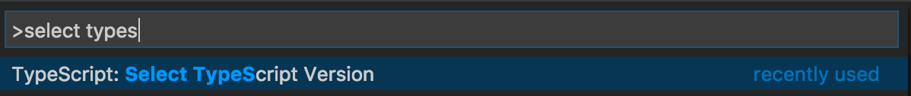
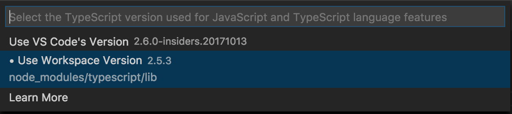

# TypeScript-styled-plugin Example project

Demonstrate how to use the [typescript-styled-plugin](https://github.com/Microsoft/typescript-styled-plugin/)

**Setup**

1. Run
    ``` bash
    $ cd typescript-styled-plugin-example-project
    $ npm install
    ```

2. Open the project folder in VS Code

3. In VS Code, open `index.js` and run the `Select TypeScript Version` command

    

4. Make sure the workspace version of TypeScript is active

    

